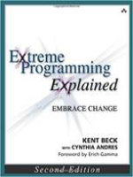
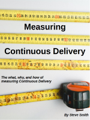
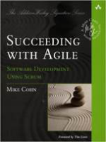
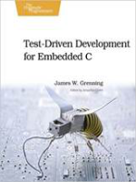
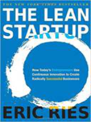

# awesome-tech-library

A collection of awesome tech related books.

|                                             |                        |                    |                      |                                                |
| --------------------------------------------------------------------------------------------------- | ----------------------------------------------------------------------------------------------- | ------------------------------------------------------------------ | ------------------------------------------------------------------- | --------------------------------------------------------------------------------------------------- |
|                                           |                                                       |                   |         |                                   |
|                                                 |                  |  |    |                      |
|                                                     |  |                       |             |  |
|  |                            |     |  |       |
|                          |                                |     |                |                                     |
|          |                           |                                                                    |                                                                     |                                                                                                     |
  

 

